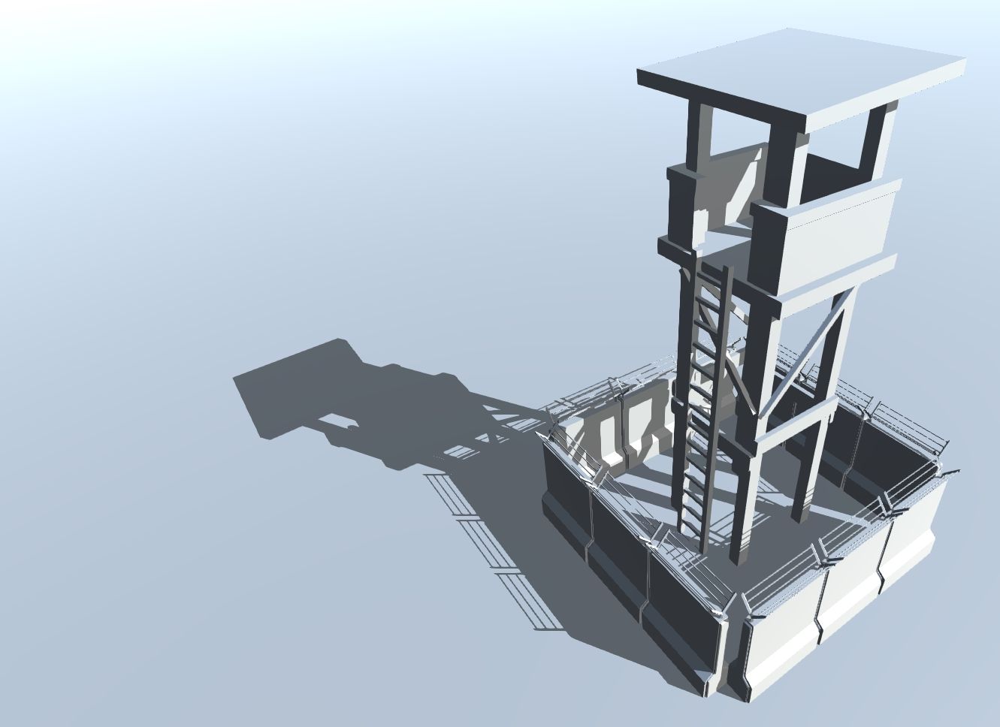

# Shadow Volume

Shadow Volume for Static-Scene-Object of Unity

### Advantage

Generally, using Lightmap to present shadow in a scene. If you need sharp shadow edge, a huge size Lightmap texture must be baked. It will cost mush performance during rendering these Lightmap textures. Sometimes, even a size of 4096x4096 texture is not enough to present sharp shadow edge. And so many Lightmap textures will break the Static-Batching.

In this case, Shadow Volume is a solution. It is particularly suitable for Toon-Rendering-Shadow and Polygon-Style-Shadow.

### Usage

Scene : Assets/ShadowVolume/Example/Test1.unity Test2.unity

Editor : Window->Lighting->Shadow Volume Setting

> 
